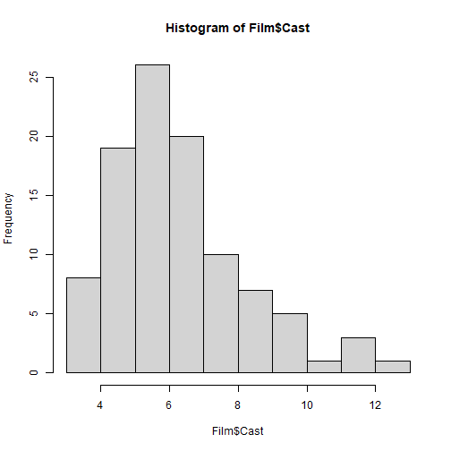
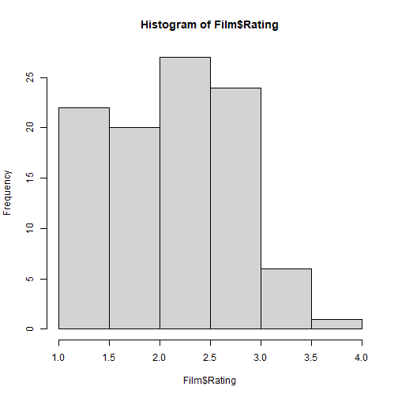

Presentation of Dataset Film
========================================================
author: Danyu Zhang 
date: 03.03.2020
autosize: true
font-import: https://fonts.googleapis.com/css2?family=Roboto:wght@100&display=swap
font-family: 'Roboto:wght'

This presentation will include the description of the dataset **Film** of library *Stat2Data*. 

It consists of Film data from Maltin's Movie and Video Guide. 


<style>
.small-code pre code {
  font-size: 25px;
}
</style>

Brief Description of the Dataset
========================================================
incremental: true
transition: fade
class: small-code

It is a data frame of Film with 100 observations on the following 9 variables. 

For more details on the dataset Film please visit [link](https://cran.r-project.org/web/packages/Stat2Data/Stat2Data.pdf).


```r
head(Film)
```

```
                         Title Year Time Cast Rating Description Origin
1            A_Ticklish_Affair 1963   89    5    2.0           7      0
2 Action_in_the_North_Atlantic 1943  127    7    3.0           9      0
3        And_the_Ship_Sails_On 1984  138    7    3.0          15      3
4                Autumn_Sonata 1978   97    5    3.0          11      5
5           Bachelor_Apartment 1931   77    6    2.5           7      0
6           Benson_Murder_Case 1930   69    8    2.5          10      0
  Time_code Good
1     short    0
2      long    1
3      long    1
4      long    1
5     short    0
6     short    0
```


Summary of the Dataset
========================================================
type: sub-section
transition: fade
class: small-code


```r
summary(Film)
```

```
                          Title         Year           Time       
 A_Ticklish_Affair           : 1   Min.   :1924   Min.   : 45.00  
 Action_in_the_North_Atlantic: 1   1st Qu.:1949   1st Qu.: 81.00  
 And_the_Ship_Sails_On       : 1   Median :1966   Median : 93.00  
 Autumn_Sonata               : 1   Mean   :1964   Mean   : 92.87  
 Bachelor_Apartment          : 1   3rd Qu.:1978   3rd Qu.:101.25  
 Benson_Murder_Case          : 1   Max.   :1995   Max.   :145.00  
 (Other)                     :94                                  
      Cast           Rating       Description        Origin     Time_code 
 Min.   : 3.00   Min.   :1.000   Min.   : 5.00   Min.   :0.00   long :58  
 1st Qu.: 5.00   1st Qu.:2.000   1st Qu.: 8.00   1st Qu.:0.00   short:42  
 Median : 6.00   Median :2.500   Median : 9.50   Median :0.00             
 Mean   : 6.75   Mean   :2.335   Mean   :10.02   Mean   :0.48             
 3rd Qu.: 8.00   3rd Qu.:3.000   3rd Qu.:12.00   3rd Qu.:0.00             
 Max.   :13.00   Max.   :4.000   Max.   :21.00   Max.   :6.00             
                                                                          
      Good     
 Min.   :0.00  
 1st Qu.:0.00  
 Median :0.00  
 Mean   :0.31  
 3rd Qu.:1.00  
 Max.   :1.00  
               
```

Variables of the Dataset
========================================================
type: sub-section
transition: fade

1. *Title* Movie title
2. *Year* Year the movie was released
3. *Time* Running time (in minutes)
4. *Cast* Number of cast members listed in the guide
5. *Rating* Maltin rating (range is 1 to 4, in steps of 0.5)
6. *Description* Number of lines of text Maltin uses to describe the movie
7. *Origin* Country: 0 = USA, 1 = Great Britain, 2 = France, 3 = Italy, 4 = Canada
8. *Time_code* long=90 minutes or longer short=under 90 minutes
9. *Good* 1=rating of 3 stars or better 0=any lower rating 3. 

Decriptive plots
========================================================
type: sub-section
transition: fade

Histogram of covariate, **casts**



***

Histogram of response variable, **rating**




Decriptive plots
========================================================
type: sub-section
transition: fade

Through this plot we can observe the linear relationship between variables **casts** and **ratings**.


<style>
  .p_iframe iframe {
    width:50%;
    height:576px;
}
</style>

<div class="p_iframe">
<iframe frameborder="0" seamless='seamless' scrolling=no src="plotly.html"></iframe>
</div>


